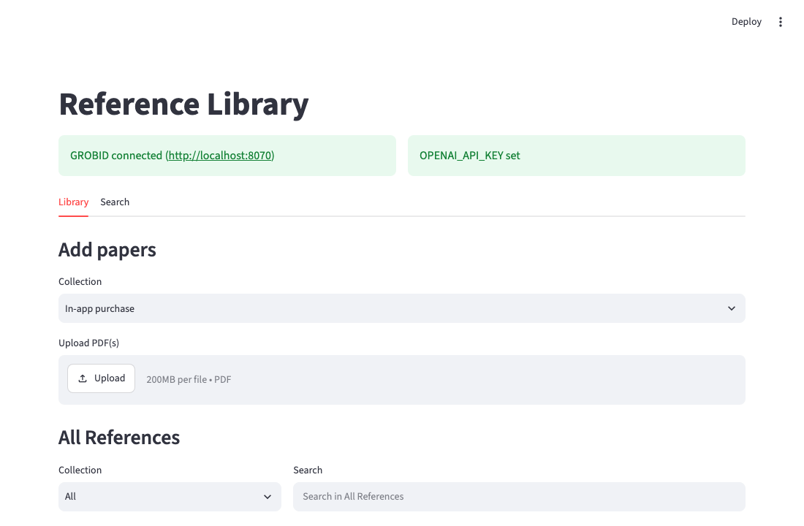
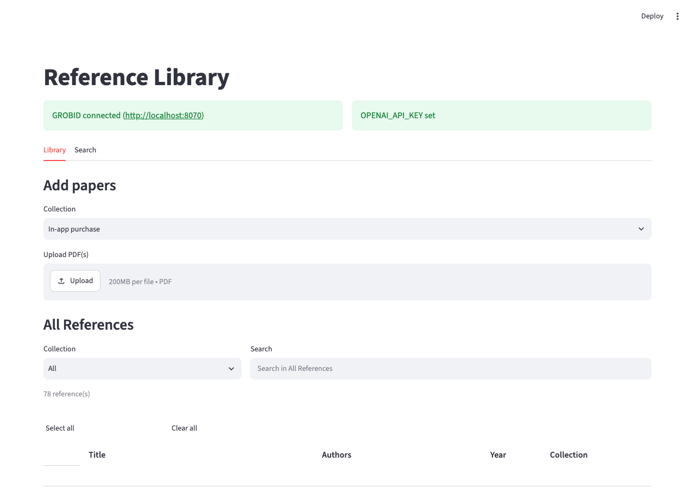
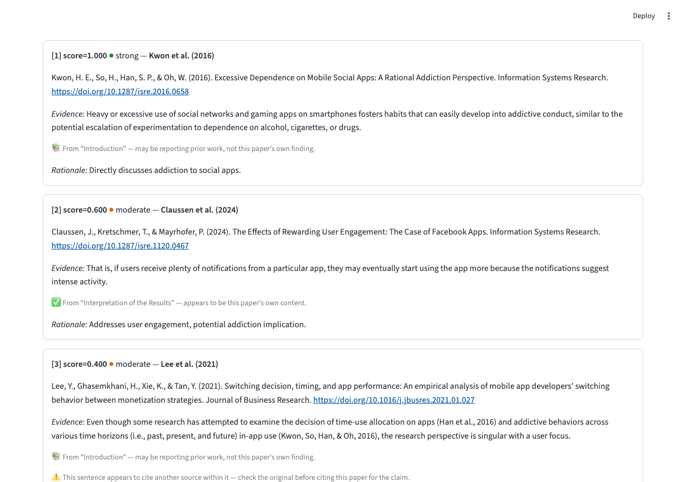
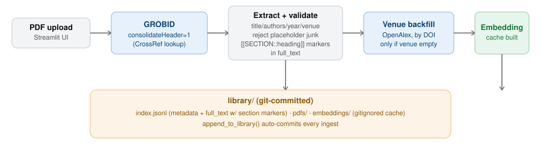
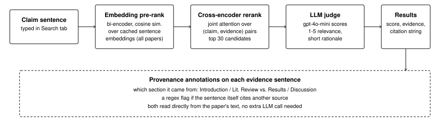

# Sourcerer

A personal citation-finding tool. Upload your PDF library, type a claim sentence, and it finds which of your own papers actually supports it, with the exact sentence it's judging from.

## Why this exists

Writing a literature review means constantly checking "do I already have a source for this?" The usual tools don't quite answer that question.

- **No search inside the PDFs.** Reference managers (Zotero, Mendeley, EndNote) are good at storing and tagging papers, but you still have to remember which one said what, or read back through your library by hand.
- **Misses paraphrases.** Keyword search (Ctrl+F, or a reference manager's search box) only finds exact word matches. A sentence phrased differently from your claim, even if it means the same thing, gets missed.
- **Can invent or misattribute.** Asking an LLM directly for a citation is risky two ways: it can name a paper that doesn't exist, and even when it names a real one, it usually can't tell you whether that paper is really making the claim itself, or just quoting someone else's finding while it sets up its own background section.
- **Searches the wrong library.** Google Scholar and Semantic Scholar search the whole web's literature, not your own already-vetted collection, so half the results are papers you don't have and haven't read.

Sourcerer only searches papers you've actually ingested, so every result is something you can open and cite right away. It shows the literal sentence its judgment is based on, not a paraphrase. And it flags when that sentence looks like it's reciting a different source, which is the exact failure mode where you'd otherwise cite the wrong paper for a claim.

## Demo



## Screenshots

**Library.** Upload PDFs, browse or filter your collection, click a row to see its details inline.




**Search.** Ask a claim sentence, get ranked results with provenance signals.



## Architecture

**Ingest**, what happens when you upload a PDF:



- GROBID extracts title, authors, year, venue, abstract, and full text. `consolidateHeader=1` cross-checks that against CrossRef, because GROBID's own layout-based parser can badly mis-segment author names or miss the venue entirely, and consolidation fixes most of that for free.
- Placeholder or garbage metadata (a `"untitled"` field, an internal tracking code masquerading as a title) gets rejected instead of trusted at face value.
- Section headings (Introduction, Results, and so on) are kept as inline markers in the stored text instead of being flattened away, so a piece of evidence can later be traced back to which section it came from.
- A missing venue gets a one-time OpenAlex lookup by DOI, written straight into the record. It's a one-time cost at ingest, never something a search has to pay for.
- Every ingest is auto-committed to git, so the library builds up real version history.

**Search**, what happens when you type a claim sentence:



- **Embedding pre-rank.** A bi-encoder (`all-MiniLM-L6-v2`) compares the claim against cached per-sentence embeddings for every paper. Cheap, but it embeds the claim and each candidate independently, with no cross-attention between them, so it can be fooled by shared vocabulary that isn't actually relevant.
- **Cross-encoder rerank.** `cross-encoder/ms-marco-MiniLM-L-6-v2` re-scores the top 30 by attending to the claim and the evidence text jointly, which catches the bi-encoder's false positives. It can't be cached the way the bi-encoder can, since the score depends on the specific claim, so it only runs on the pre-ranked shortlist.
- **LLM judge.** `gpt-4o-mini` gives each shortlisted candidate a final 1 to 5 relevance score and a short rationale.
- **Provenance annotations.** Computed straight from the paper's own text, no extra LLM call needed: which section the evidence sentence lives in, and a regex check for an embedded citation marker like `(Smith, 2020)` or `[12]`, which suggests the sentence is itself reciting a different source rather than stating the paper's own finding.

A search result is never just a paper name. Every result shows the relevance score, the evidence sentence, the LLM's rationale, and which section it came from, all together, on purpose. None of these signals is trustworthy enough on its own to decide "yes, cite this" for you, and it shouldn't try to. The researcher is the one who has to stand behind the citation, so the tool's job is to make that judgment call fast and well informed, not to make it instead of you.

## Requirements

- Python 3.12 (developed and tested on this version, though slightly older 3.x is likely fine since nothing here relies on very new syntax)
- Docker, to run GROBID (the PDF parser). Nothing else here needs it.
- An OpenAI API key. Required, since the LLM judge that scores each candidate runs on `gpt-4o-mini`. Nothing in the app works without it.
- An OpenAlex API key. Optional. Without it, papers with a DOI but no venue in their PDF metadata just keep an empty venue field instead of getting it backfilled; everything else works the same.

## Setup

```bash
python -m venv .venv
source .venv/bin/activate
pip install -r requirements.txt
cp .env.example .env  # fill in OPENAI_API_KEY at minimum
```

GROBID runs as a local Docker container. The easiest way to start everything is:

```bash
./start_app.command
```

This starts the GROBID container if it isn't already running (waiting until it's actually ready, not just launched) and then starts the Streamlit app. That's the only command you need day to day.

If you'd rather run the two pieces yourself:

```bash
docker run -d --name grobid -p 8070:8070 grobid/grobid:0.8.1
streamlit run app.py
```

`library_finder.py` is a CLI that covers the same ingest/search functionality as the Streamlit app, for anyone who'd rather script it or skip the UI.
